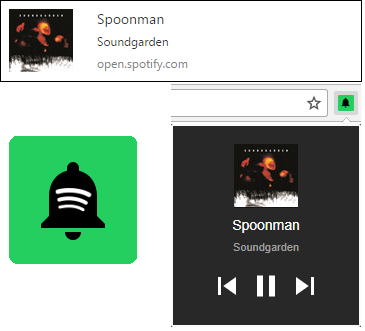

# Notifications For Spotify
Add notifications and controls to [open.spotify.com]

As of version __v0.4.0__ a browser action icon will also show the currently playing song with track controls when clicked.

The browser tab for [open.spotify.com] must remain open for notifications to appear and the browser action to function.

## Download
* [Chrome Web Store](https://chrome.google.com/webstore/detail/notifications-for-spotify/filocihllcicedfecomcdlilalmcfohi?hl=en-US&gl=US) (v0.3.1)
* [Firefox Add-ons](https://addons.mozilla.org/en-US/firefox/addon/notifications-for-spotify/) (v0.3.1)

## Features
#### Web Notifications for current song
* Show web notification with song title, artist, and album art
* Notification is shown when [open.spotify.com] is opened and when song changes

#### Browser action with song preview and controls
* Browser action icon will show currently playing song with controls to play/pause/change track
* Clicking links in the browser action popup window will focus the Spotify tab and show the album or artist clicked

#### Keyboard Shortcuts
* __Ctrl+Shift+S:__ Show browser action with song preview
* __Ctrl+Shift+Space:__ Toggle Play/Pause for current song from anywhere in the browser
* Keyboard shortcuts may be changed on the `chrome://extensions/` page by strolling to the bottom of the page and clicking "Keyboard Shortcuts"

## Recent Changes
* __v0.4.0__:
  * __Feature:__ Add track controls to browser action
  * __Feature:__ Add links to browser action to jump to album or artist
  * __Feature:__ Add browser keyboard shortcut to show browser action (default: `Ctrl+Shift+S`)
  * __Feature:__ Add browser keyboard shortcut play/pause track from any tab (default: `Ctrl+Shift+Space`)
  * __Bugfix:__ Don't show multiple notifications if rapidly changing track
  * __Bugfix:__ Fix browser action doesn't work if notifications are not granted
* __v0.3.1__:
  * __Bugfix:__ Fix cover art scaling in browser action popup
  * __Security:__ Replace `innerHTML` calls with `textContent`
* __v0.3.0__:
  * __Feature:__ Implement browser action to show currently playing song
* __v0.2.0__:
  * __Performance:__ Replace recursive `setTimeout` call with `MutationObserver`

## License
[GNU GPLv3](LICENSE)

[open.spotify.com]: https://open.spotify.com/
